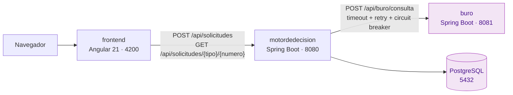
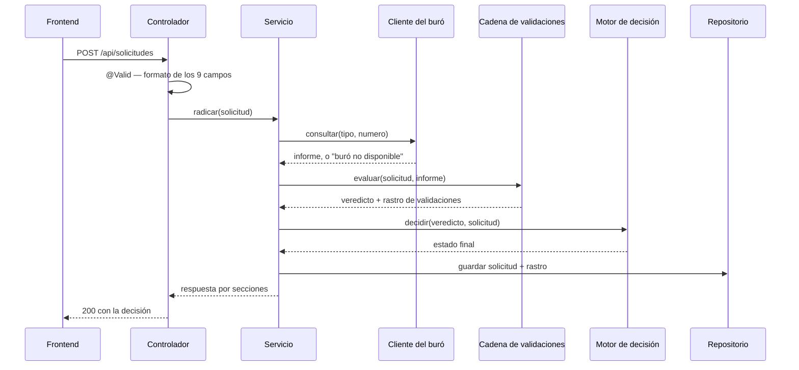

# Documento de diseño — CreditValidation

Cómo está construido el sistema, qué patrones se aplicaron y por qué, qué
ambigüedades del enunciado se encontraron y cómo se resolvieron.

Para levantar el proyecto, ver **[README.md](README.md)**.

---

## 1. Arquitectura

### 1.1 Vista general



**El buró es un servicio desplegable aparte, no un stub embebido en el motor.**
Es la decisión estructural que sostiene todo lo demás: con un mock en memoria,
el timeout, el reintento y el circuit breaker serían decorativos — no habría
nada que pudiera tardar de verdad. Con un servicio real al otro lado de HTTP,
el caso del documento `0000000000` ejercita la resiliencia completa.

### 1.2 Flujo de una radicación



Un rechazo **no es un error HTTP**: la radicación fue exitosa, y su resultado
es que el crédito se niega. Solo la entrada mal formada produce un `400`.

### 1.3 Organización por capas

Se usa una organización por capas conocida (`api`, `config`, `domain`, `dto`,
`infraestructura`, `mapper`, `util`), con servicios declarados como interfaz e
implementados en `service/imp`. **No se usó arquitectura hexagonal**: para tres
casos de uso, sus puertos y adaptadores habrían añadido más ceremonia que
protección.

Sobre esa base se aplica una regla: al abrir el árbol de paquetes debe verse
**qué sistema es**, no solo qué framework usa. Por eso los paquetes bajo
`domain/` se llaman `validacion`, `decision` y `entities` — quien abra el
repositorio sin contexto ve de inmediato que esto evalúa solicitudes de crédito.

**`domain/validacion` y `domain/decision` son Java puro**: no importan Spring
ni JPA. La configuración entra por constructor. Eso permite probarlos con
`new`, sin levantar contexto, y es lo que hace que los tests de la tabla de
decisión corran en milisegundos.

### 1.4 Modelo de datos

El esquema versionado en `motordedecision/db/sql/01-create_schema.sql` es la
**fuente de verdad**: las entidades se ajustan a él, no al revés. Hibernate
arranca con `ddl-auto: validate`, así que una entidad desalineada del script
hace fallar el arranque en vez de deformar la base en silencio.

| Tabla | Qué guarda |
|---|---|
| `solicitud` | La solicitud radicada, su estado final y la tasa que se le ofreció |
| `resultado_validacion` | El rastro de cada validación ejecutada: orden, nombre, resultado y detalle |

La solicitud tiene **clave técnica** (`id`) separada del **identificador de
negocio** (`id_solicitud`, con formato `SOL-yyyyMMdd-NNN`). El consecutivo del
día se calcula en la aplicación y la unicidad la cierra una restricción de la
base.

---

## 2. Patrones aplicados

El enunciado plantea dos problemas de diseño explícitos: **extensibilidad**
(agregar una validación nueva sin romper las existentes) y **construcción**
(armar una respuesta que cambia de forma según el resultado). Estos son los
patrones que los resuelven.

| Patrón | Dónde vive | Problema que resuelve | Alternativa descartada |
|---|---|---|---|
| **Chain of Responsibility** | `CadenaDeValidaciones` (`domain/validacion`) | Detener en la primera validación fallida sin un `if` gigante, dejando el rastro de lo que sí se alcanzó a evaluar | Un servicio con cuatro `if` encadenados: cada validación nueva lo alarga y obliga a releerlo entero para saber qué corta dónde |
| **Strategy** | Cada `ValidacionCrediticia` y cada `ReglaDecision` | Agregar una validación o una regla sin tocar las existentes | Un `enum` con la lógica en cada constante: no admite configuración por constructor y arrastraría los umbrales al código |
| **Builder + aportantes de sección** | `SolicitudCreditoResponse.Builder` y `AportanteDeSeccion` (`mapper`) | Armar la respuesta por partes, con las secciones que aplican a cada estado, sin que las ausentes viajen como `null` | Un `if` por estado dentro de un método armador: cada estado nuevo obligaría a modificarlo |
| **Circuit Breaker + Retry + Fallback** | `BuroClientHttp` (`infraestructura/client`) | El buró caído no puede tumbar la radicación: se reintenta con backoff y jitter, se deja de insistir cuando lleva fallando, y el fallo se convierte en un valor que acaba en `PENDIENTE_REVISION` | Un `try/catch` que devolviera el mismo valor: sin reintento no absorbe el fallo transitorio, y sin circuito sigue castigando a un buró caído |
| **Interfaz de servicio + implementación** | `SolicitudCreditoService` / `...Imp` | El controlador depende del contrato, no de cómo se orquesta | Inyectar la implementación directa: acopla la capa web a la orquestación |

### 2.1 Extensibilidad: la prueba de fuego

**Agregar una quinta validación** no obliga a modificar ninguna de las cuatro
existentes ni al orquestador: se implementa la interfaz y se añade a la lista
de `ConfiguracionCadenaDeValidaciones`. Lo mismo con una sección nueva de la
respuesta o una regla de decisión nueva.

**El orden es contrato, y lo fija una lista literal**, no el escaneo de
componentes de Spring. Es deliberado: el orden de las validaciones decide qué
error ve el solicitante, y el de las reglas decide qué estado gana cuando dos
filas de la tabla aplican a la vez. Dejar eso al orden de escaneo sería dejar
un requisito del enunciado en manos de un detalle del framework.

### 2.2 Resiliencia

El caso del enunciado — documento `0000000000`, servicio caído — se ejercita de
punta a punta:

1. El buró **retrasa** su respuesta 10 segundos (configurable). Un servidor no
   puede "responder un timeout"; lo que puede es tardar.
2. El cliente del motor agota su tiempo de espera de lectura (2 s), reintenta
   con backoff exponencial y jitter, y el circuit breaker corta si el buró
   lleva fallando.
3. El fallback devuelve un **valor de dominio** ("buró no disponible"), no una
   excepción.
4. La cadena de validaciones se detiene antes de la primera validación que
   necesitaría el informe, sin registrarla: leer un informe ausente convertiría
   una falla del servicio en un rechazo al solicitante.
5. La regla de decisión traduce ese valor a `PENDIENTE_REVISION`.

El resultado es un `200` con revisión manual, nunca un `5xx`.

---

## 3. Manejo de errores

Ambos servicios publican el mismo contrato. Un `400` no dice "hay un error":
dice **qué campo**, **por qué** y **dónde venía**.

```json
{
  "message": "Error en los datos proporcionados",
  "errors": [
    {
      "field": "montoSolicitado",
      "message": "Monto solicitado no debe exceder 50000000",
      "location": "body"
    }
  ]
}
```

Decisiones que lo sostienen:

- **Las excepciones se separan en negocio y técnica.** Las de negocio responden
  `4xx` con un código estable y se loguean como `WARN`; las técnicas responden
  `500` sin código y se loguean como `ERROR` con la traza.
- **Ninguna traza de pila llega al cliente**, y el `500` no filtra el mensaje
  interno de la excepción.
- **Varios campos inválidos se devuelven todos**, no solo el primero.
- **Un JSON malformado da `400`**, no `500`.
- **La traducción de código de negocio a estado HTTP vive en el manejador**, no
  en el enum: el enum describe el error, el manejador decide cómo se ve por
  HTTP.

---

## 4. Estrategia de pruebas

| Servicio | Tests | Qué cubren |
|---|---|---|
| `buro` | 93 | Generador determinista del score, contrato de validación, cada familia de error, endpoint con MockMvc |
| `motordedecision` | 247 | Cada validación y cada regla por separado, la tabla de decisión completa con sus bordes, el cliente resiliente, la persistencia y los dos endpoints |
| `frontend` | 38 | Validaciones del formulario espejo del backend, el servicio HTTP y el ciclo de envío |

Principios aplicados:

- **Ninguna prueba depende de la red, del reloj ni del orden de ejecución.** La
  fecha se sella con un `Clock` inyectable; el buró se dobla con un servidor
  HTTP real levantado en memoria, no con un mock del cliente — así el test
  ejercita la serialización y el timeout de verdad.
- **Las pruebas contra PostgreSQL real usan Testcontainers y se saltan, sin
  romper el build, en una máquina sin Docker.** Sirven para detectar la deriva
  entre las entidades y el script del esquema.
- **La tabla de decisión se prueba con tests parametrizados**, un caso por fila
  y los bordes en pareja (699/700, 5x y 5x+1, 8x y 8x+1), contra el bean real
  armado con los umbrales de `application.yml`.
- **Se usó prueba de mutación como control de calidad de los tests**: se
  invierte un operador o se cambia un umbral y se comprueba que algún test cae
  en rojo. Un mutante que no rompe nada significa que ese criterio no tiene
  evidencia que lo proteja.

### 4.1 Deuda conocida

**El frontend no tiene tests de la vista de resultado ni de la pantalla de
consulta de estado.** Los 38 tests existentes cubren el scaffold y el
formulario. Fue una decisión consciente de alcance por tiempo, tomada al final
del proyecto; se deja registrada aquí en vez de disimularla.

---

## 5. Decisiones de infraestructura

| Decisión | Por qué |
|---|---|
| **El motor compila en Java 17 y el buró en 21** | El motor arrastra dependencias sin build compatible con 21 en el momento del scaffold. Se prefirió acotar la versión de un módulo antes que renunciar a una librería. |
| **PostgreSQL, no H2 en ejecución** | El enunciado permite elegir; una base real hace que el script de esquema, las restricciones y los tipos sean auténticos. H2 se queda para las pruebas. |
| **El esquema lo pone un script versionado, nunca Hibernate** | `ddl-auto: validate` hace fallar el arranque si una entidad se desalinea, que es justo lo que se quiere ver. |
| **Los valores van escritos en los archivos, sin `.env`** | Es un entorno local desechable y la prueba debe poder levantarse sin pasos previos. En producción esto sería lo contrario. |
| **El frontend llama rutas relativas y un proxy resuelve el destino** | El motor no publica CORS, y ninguna URL absoluta sirve a la vez al navegador del host y a la red interna de Docker. El proxy es la única pieza que necesita conocer al motor. |
| **Angular 21 (LTS), no la 22** | El enunciado pide "16+", que es un piso. La 22 está en soporte activo, no es LTS. |
| **Healthchecks contra los endpoints reales** | Ningún servicio trae actuator. La sonda del motor consulta el estado de un documento sin solicitudes, lo que de paso comprueba que la base responde. |

---

## 6. Ambigüedades del enunciado y cómo se resolvieron

El enunciado dice: *"Si tienes dudas sobre los requerimientos, documéntalas y
toma una decisión."* Esta es esa documentación. Se listan las de mayor impacto;
el registro completo, con la alternativa descartada de cada una, se llevó
durante todo el desarrollo.

| Ambigüedad | Decisión | Justificación |
|---|---|---|
| **El umbral 600 aparece dos veces y no es el mismo número.** La validación de score y la fila `PREAPROBADO` usan 600; la fila `APROBADO` usa 700, y el ejemplo de respuesta muestra `"Score 750 >= 700"` en el detalle de la validación | La cadena corta en 600; 700 es el corte de `APROBADO`. El detalle adopta el **formato** del enunciado con el umbral que la validación aplicó de verdad | Usar 700 en la cadena rechazaría los scores 600-699 que la fila `PREAPROBADO` manda aceptar. La divergencia queda acotada al valor, no a la conducta |
| **La tabla de decisión no es exhaustiva:** score 600-699 con monto de más de cinco veces los ingresos no encaja en ninguna fila | `PENDIENTE_REVISION`, con una regla propia que cierra la lista | Ninguna validación lo rechazó, así que rechazarlo castigaría al solicitante por un vacío del enunciado; y una excepción convertiría una decisión de negocio en un error de servidor |
| **Varias filas aplican a la vez** (documento bloqueado con el buró caído; score alto que cumple `APROBADO` y `PREAPROBADO`) y no se fija la precedencia | Orden explícito: fraude, buró no disponible, rechazo, aprobado, preaprobado, revisión manual. Decide la primera que aplica | Es el orden que hace cumplir lo que el enunciado sí dice: un documento en lista negra se rechaza por fraude esté el buró en pie o no |
| **Hay dos múltiplos de ingresos** (ocho y cinco) para lo que parece el mismo umbral | La cadena rechaza por encima de ocho; el cinco lo aplica la regla de decisión | La cadena filtra lo inviable, la decisión gradúa lo viable |
| **"Responder con timeout"** para el documento `0000000000`: un servidor no puede responder un timeout | El buró retrasa la respuesta un tiempo configurable y luego responde `200`; el timeout lo declara el motor | Es lo que ejercita de verdad la resiliencia del cliente, en vez de un `503` inmediato |
| **`tasaEstimada: 1.2` aparece en el ejemplo y nunca se dice cómo se calcula** | Una tasa por estado, en configuración. Sin entrada, no viaja tasa | Inventar una fórmula sobre el score sería un modelo de riesgo que nadie pidió ni puede validar |
| **Solo se fijan las secciones de `APROBADO` y del rechazo temprano** | Solicitante, detalle y evaluación en los cinco estados; tasa y siguiente paso solo donde la configuración los declara | La regla vive en un dato ausente, no en un `if` que enumere estados: es lo que permite agregar secciones sin tocar las existentes |
| **No se fija la ruta de la consulta de estado ni qué campos lleva cada elemento** | `GET /api/solicitudes/{tipoDocumento}/{numeroDocumento}`; cada elemento lleva id, fecha, estado, monto, plazo y la tasa sellada, sin el rastro de validaciones | El par identifica el recurso; un tipo fuera del catálogo cae en el contrato de errores con `location=path` |
| **No se dice qué pasa si dos radicaciones del mismo día compiten por el consecutivo** | Se acepta la carrera: la restricción `UNIQUE` hace fallar la segunda en voz alta | Reintentar una operación no idempotente es peor, y serializar el consecutivo es un mecanismo completo para un choque teórico |
| **No se dice qué responder si la base falla después de decidir** | La radicación falla completa: `500`, sin devolver la decisión | Una decisión sin fila rompería la consulta de estado que el enunciado exige; mejor un error franco que un éxito que la siguiente consulta negaría |
| **No se dice cómo llega el navegador al motor** (sin CORS y con Docker por delante) | Rutas relativas más proxy del dev-server | Ninguna URL absoluta sirve a la vez al navegador del host y a la red del compose |
| **No se fija la longitud ni el formato del número de documento** | Solo dígitos, entre 6 y 15 | Cubre cédula, cédula de extranjería y el caso `0000000000` del propio enunciado |
| **"Hardcodear una lista de 3-5 documentos como lista negra"** | Cuatro documentos, en configuración, no en el código | Son datos de negocio: se ajustan sin recompilar |

---

## 7. Uso de IA

El enunciado permite el uso de IA y pide indicar en qué partes se usó y con qué
prompts. **Todo el desarrollo se hizo con Claude Code (modelos Opus y Fable) en
un flujo asistido**, no puntualmente.

### 7.1 Cómo se organizó el trabajo

En vez de pedir código suelto, se construyó un **arnés de trabajo** que impone
un método sobre el asistente:

| Pieza | Qué hace |
|---|---|
| `feature_list.json` | 21 features con criterios de aceptación explícitos. Una sola en curso a la vez. |
| `AGENTS.md`, `docs/` | Convenciones, arquitectura, contrato de errores y criterios de verificación, escritos **antes** de implementar. |
| `init.sh` | Verifica el entorno y corre las tres suites. Nada se cierra si termina en rojo. |
| Subagentes `leader` / `implementer` / `reviewer` | El líder descompone y no escribe código; el implementador hace una feature con sus tests; el revisor aprueba o rechaza contra los criterios. |
| `docs/decisions.md` | 66 decisiones registradas con su alternativa descartada, escritas cuando se tomaron, no al final. |

El revisor tenía autoridad de rechazo real y la ejerció: la feature de reglas de
decisión fue **rechazada en primera pasada** por tener el código correcto pero
sin evidencia ejecutable —seis tests que recorrían el mecanismo con reglas
falsas y ninguno que tocara la tabla del enunciado—. La corrección llevó la
suite del motor de 93 a 148 tests.

### 7.2 Forma de los prompts empleados

Los prompts siguieron un patrón estable, no fueron peticiones abiertas:

- **Al implementador:** *"Implementa exactamente la feature N. Estos son sus
  criterios de aceptación. Lee estos documentos primero. Estas ambigüedades las
  decides tú: regístralas en `docs/decisions.md` con la alternativa descartada.
  Verifica con `./init.sh` completo. Escribe tu informe en
  `progress/impl_<nombre>.md`."*
- **Al revisor:** *"Revisa la feature N contra sus criterios. Verifica de
  primera mano, no reportes lo que dice el informe. Aplica dos o tres mutantes
  sobre los criterios: un mutante que no ponga ningún test en rojo es
  bloqueante. No arregles el código; documenta y devuelve."*
- **Correcciones concretas** cuando el resultado no convencía, por ejemplo:
  alinear el detalle de la validación de score al formato del enunciado
  conservando el umbral real, o partir un test que tenía dos *actos* en uno.

### 7.3 Qué se hizo a mano

- La **decisión de qué construir y en qué orden**: el desglose en 21 features,
  sus criterios de aceptación y las prioridades cuando el tiempo apretó.
- El **arbitraje de las ambigüedades** cuando había que elegir entre
  interpretaciones del enunciado.
- Los **cambios de alcance**: renunciar a los tests del frontend en las dos
  últimas vistas fue una decisión explícita, no una omisión del asistente.
- La **verificación de lo entregado**: cada cierre de feature se comprobó
  ejecutando las suites, no dando por buenos los informes.

### 7.4 Registro cronológico

| Fecha | Parte del trabajo | Prompt / instrucción resumida |
|---|---|---|
| 2026-08-29 | Arnés de trabajo (AGENTS.md, docs, feature_list, init.sh, subagentes) | Replicar el patrón de arnés de un repositorio de ejemplo y derivar las convenciones de los skills del equipo |
| 2026-08-29 a 08-30 | Buró completo (features 1-5) | Ciclo implementer → reviewer por feature, con los criterios de aceptación como contrato |
| 2026-08-30 a 08-31 | Motor completo (features 6-14) | Igual, con las ambigüedades de umbrales y precedencia delegadas con orden expresa de registrarlas |
| 2026-08-31 | Frontend (features 15-18) | Scaffold con revisión; formulario con validaciones espejo del DTO del backend; vista de resultado y consulta de estado con alcance reducido por tiempo |
| 2026-08-31 | Entrega (features 19-21) | Compose de los cuatro servicios verificado de punta a punta; colección de API; esta documentación |

---

## 8. Qué haría distinto con más tiempo

- **Cerrar la deuda de tests del frontend** (§4.1): la vista de resultado y la
  consulta de estado deberían tener sus tres estados cubiertos.
- **Autenticación y autorización**: el sistema hoy no tiene ninguna. Para un
  flujo de crédito real es lo primero que faltaría.
- **Trazabilidad**: un identificador de correlación que atraviese frontend,
  motor y buró, para seguir una radicación por los logs de los tres servicios.
- **Observabilidad**: actuator con métricas y health reales, en vez de sondas
  que golpean los endpoints de negocio.
- **Imagen de producción del frontend**: hoy el contenedor corre el dev-server
  de Angular. Lo correcto sería un build estático servido por Nginx, que además
  resolvería el proxy sin depender de la herramienta de desarrollo.

---

**Última actualización:** 2026-08-31
