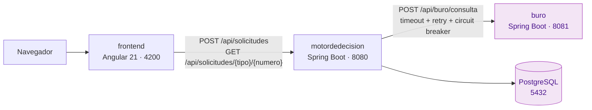

# CreditValidation — Sistema de solicitud de crédito de consumo

Sistema que recibe solicitudes de crédito de consumo, consulta la información
crediticia del solicitante contra un buró externo y decide de forma automática
si la solicitud se aprueba, se preaprueba, se rechaza o queda en revisión.

Este README explica **cómo levantar el sistema**. El diseño, los patrones
aplicados y las decisiones tomadas están en **[DISENO.md](DISENO.md)**.

---

## 1. Arquitectura en un vistazo



| Módulo | Carpeta | Puerto | Rol |
|---|---|---|---|
| Buró de crédito | `buro/` | 8081 | Servicio externo simulado. No persiste nada. |
| Motor de decisión | `motordedecision/` | 8080 | Recibe la solicitud, consulta el buró, decide y persiste. |
| Frontend | `frontend/` | 4200 | Formulario de radicación y consulta de estado. |
| Base de datos | — | 5432 | PostgreSQL. El esquema lo pone un script versionado. |

El buró es un **servicio aparte**, no un stub dentro del motor: es lo que hace
que la integración HTTP, los timeouts y la resiliencia sean reales.

---

## 2. Ejecución con Docker Compose (recomendado)

Es la forma de levantar el sistema completo con un solo comando. No requiere
tener Java, Maven ni Node instalados: cada imagen compila lo suyo.

### Requisitos

- Docker Desktop en ejecución.

### Comando

```bash
docker compose up --build
```

La primera vez tarda varios minutos porque compila los dos servicios Java y
descarga las dependencias del frontend. Cuando los cuatro contenedores quedan
`healthy`, la aplicación está en **http://localhost:4200**.

### Qué levanta

| Servicio | Contenedor | Puerto en el host |
|---|---|---|
| `db` | `creditvalidation-db` | 5441 |
| `buro` | `creditvalidation-buro` | 8081 |
| `motor` | `creditvalidation-motor` | 8080 |
| `frontend` | `creditvalidation-frontend` | 4200 |

El orden de arranque lo gobiernan los healthchecks: el motor no arranca hasta
que la base y el buró responden, y el frontend no arranca hasta que el motor
responde.

### Comandos útiles

```bash
docker compose ps                 # estado y salud de los cuatro servicios
docker compose logs -f motor      # seguir el log de un servicio
docker compose down               # bajar todo, conservando los datos
docker compose down -v            # bajar todo y borrar la base (vuelve a sembrarse)
```

> **Si el arranque falla por un puerto ocupado:** revisa que no tengas el buró
> o el motor corriendo desde el IDE. Los dos modos de ejecución usan los mismos
> puertos 8080 y 8081 y no pueden convivir.

---

## 3. Ejecución local para desarrollo

Útil para depurar desde el IDE. Aquí solo la base de datos va en Docker.

### Requisitos

| Herramienta | Versión | Para qué |
|---|---|---|
| JDK | 21 | Compilar y ejecutar `buro/` |
| JDK | 17 | Compilar y ejecutar `motordedecision/` |
| Maven | 3.9+ | Construir ambos servicios |
| Node.js | 24 | Ejecutar el frontend |
| Docker | — | Levantar PostgreSQL |

Los dos servicios usan versiones distintas de Java a propósito; el porqué está
en [DISENO.md](DISENO.md).

### Paso 1 — Base de datos

```bash
cd motordedecision
docker compose up -d
```

Levanta PostgreSQL en el puerto **5440** del host, ya con el esquema y los
datos de arranque. Para volver a sembrarla: `docker compose down -v && docker compose up -d`.

### Paso 2 — Buró (puerto 8081)

```bash
cd buro
mvn spring-boot:run
```

### Paso 3 — Motor (puerto 8080)

```bash
cd motordedecision
mvn spring-boot:run -Dspring-boot.run.profiles=dev
```

El perfil `dev` apunta a `localhost:5440` (la base del paso 1) y a
`http://localhost:8081` (el buró del paso 2).

### Paso 4 — Frontend (puerto 4200)

```bash
cd frontend
npm ci
npm start
```

Queda en **http://localhost:4200**. Las peticiones salen con ruta relativa y el
proxy del dev-server las reenvía al motor; el destino se cambia con la variable
`MOTOR_URL` sin tocar código.

---

## 4. Configuración

Los valores están escritos en los archivos a propósito, sin `.env`: es un
entorno local desechable y el proyecto debe poder levantarse sin pasos previos.

### Motor (`motordedecision/src/main/resources/application.yml`)

| Propiedad | Valor por defecto | Para qué |
|---|---|---|
| `buro.url` | `http://localhost:8081` | Dónde vive el buró. En el compose entra por `BURO_URL`. |
| `buro.tiempo-espera-conexion` | `2s` | Timeout de conexión hacia el buró. |
| `buro.tiempo-espera-lectura` | `2s` | Timeout de lectura. Muy por debajo del retardo del caso caído. |
| `reglas.validacion.documentos-bloqueados` | 4 documentos | Lista negra que dispara `RECHAZADO_FRAUDE`. |
| `reglas.validacion.score-minimo` | `600` | Por debajo, la solicitud no es viable. |
| `reglas.decision.aprobado.score-minimo` | `700` | Corte de `APROBADO`. |
| `respuesta.tasa-estimada-por-estado` | por estado | Tasa que se ofrece; sin entrada, no viaja tasa. |

Perfiles: `dev` (base en `localhost:5440`) y `docker` (base en `db:5432`).

### Buró (`buro/src/main/resources/application.yml`)

| Propiedad | Valor por defecto | Para qué |
|---|---|---|
| `buro.simulacion.documento-servicio-caido` | `0000000000` | Documento que simula el servicio caído. |
| `buro.simulacion.retardo-servicio-caido` | `10s` | Cuánto se retrasa la respuesta de ese documento. |

### Frontend

| Variable | Valor por defecto | Para qué |
|---|---|---|
| `MOTOR_URL` | `http://localhost:8080` | Destino del proxy del dev-server. En el compose, `http://motor:8080`. |

---

## 5. Documentos de prueba

El buró es determinista: el score sale de una semilla derivada del propio
número de documento, así que el mismo documento produce siempre el mismo
resultado.

| Documento | Qué produce | Estado esperado |
|---|---|---|
| `1234567892` | Par, score 727 | `APROBADO` (con monto dentro de 8 veces los ingresos) |
| `1234567890` | Par, score 635 | `PREAPROBADO` (con monto dentro de 5 veces los ingresos) |
| `1234567891` | Impar, score 381 | `RECHAZADO` |
| `1010101010` | Lista de bloqueados | `RECHAZADO_FRAUDE` |
| `0000000000` | El buró tarda ~10 s | `PENDIENTE_REVISION` (el motor cae en su fallback) |

---

## 6. Endpoints

| Método | Ruta | Servicio | Qué hace |
|---|---|---|---|
| `POST` | `/api/solicitudes` | motor | Radica una solicitud y devuelve la decisión. |
| `GET` | `/api/solicitudes/{tipoDocumento}/{numeroDocumento}` | motor | Lista las solicitudes de un documento. |
| `POST` | `/api/buro/consulta` | buró | Devuelve el informe crediticio simulado. |

Ejemplo de radicación:

```bash
curl -X POST http://localhost:8080/api/solicitudes \
  -H "Content-Type: application/json" \
  -d '{
    "tipoDocumento": "CC",
    "numeroDocumento": "1234567892",
    "nombres": "Ana",
    "apellidos": "Ruiz",
    "correo": "ana.ruiz@example.com",
    "celular": "3001234567",
    "montoSolicitado": 15000000,
    "plazoMeses": 24,
    "ingresosMensuales": 10000000
  }'
```

Un rechazo **no es un error**: responde `200` con el estado correspondiente.
Solo la entrada mal formada responde `400`, y lo hace nombrando cada campo:

```json
{
  "message": "Error en los datos proporcionados",
  "errors": [
    {
      "field": "montoSolicitado",
      "message": "Monto solicitado no debe exceder 50000000",
      "location": "body"
    }
  ]
}
```

### Colección de pruebas

La carpeta `api/` trae las peticiones listas, con los casos límite del
enunciado y cada familia de error:

| Archivo | Qué contiene |
|---|---|
| `api/motor.http` | 12 peticiones del motor (los cinco estados, entrada inválida, casos límite de monto y plazo, consulta de estado). |
| `api/buro.http` | 8 peticiones del buró (par, impar, servicio caído, errores). |
| `api/motor.postman_collection.json` | La misma colección para Postman, en orden ejecutable. |
| `api/buro.postman_collection.json` | Colección del buró para Postman. |
| `api/local.postman_environment.json` | Variables `baseUrl` y `baseUrlMotor`. Importar antes de ejecutar. |

Los archivos `.http` se ejecutan desde IntelliJ o desde la extensión REST
Client de VS Code. Las URL salen de variables: para apuntar a otro entorno se
cambia una sola línea.

---

## 7. Pruebas automatizadas

```bash
cd buro && mvn test                 # buró (93 tests)
cd motordedecision && mvn test      # motor (247 tests)
cd frontend && npm test -- --watch=false --browsers=ChromeHeadless   # frontend (38 tests)
```

Ninguna prueba necesita la red, el reloj ni un servicio levantado: el buró se
dobla con un servidor HTTP real en memoria y la base con H2. Las pruebas contra
PostgreSQL real usan Testcontainers y **se saltan**, sin romper el build, en una
máquina sin Docker.

El detalle de la estrategia de pruebas está en [DISENO.md](DISENO.md).

---

## 8. Estructura del repositorio

```
buro/                  Servicio del buró simulado (Java 21)
motordedecision/       Motor de decisión (Java 17)
  db/sql/              Esquema y datos de arranque; fuente de verdad del modelo
frontend/              Aplicación Angular 21
api/                   Colecciones .http y Postman
docker/                Dockerfiles de los tres servicios
docker-compose.yml     Orquestación completa
DISENO.md              Documento de diseño, patrones y decisiones
```

---

**Última actualización:** 2026-08-31
